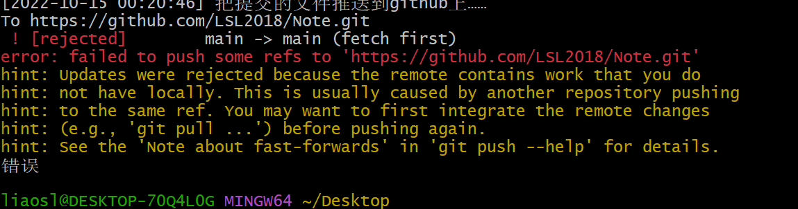

# 准备工作

```bash
#防止报错：OpenSSL SSL_read
git config --global http.sslVerify "false"
git config --global https.sslVerify "false"

#修改user.Name和user.email
#和github账户一致
git config --global user.name "LSL2018"
git config --global user.email "952418027@qq.com"

#防止超时
git config --global --unset http.proxy
git config --global --unset https.proxy
```

注：可以用git config --global -l查看全局变量，用git config -l查看所有变量


# 同步本地文件（先把github仓库文件下到本地）

在同步前保证github能访问到（可以用vpn），浏览器把“使用代理服务器关掉”

```bash
#把github仓库的文件下载下来
git clone https://github.com/LSL2018/Note.git

#进入下载好的仓库文件夹
cd Note

#git初始化，生成一个.git隐藏文件
#每次同步前要先把该.git文件删掉，不然会同步失败（？）
git init

#执行前把需要上传的文件放到Note的对应位置
#将文件添加到缓存区
#"."代表提交文件夹下的全部目录
#可以通过 git add <filename> 提交指定的文件
git add .

#查看现在的状态，可以用此判断 git add …… 是否成功
（可选）git status

#提交添加到缓存区的文件
git commit -m <注释>

# 把本地库的所有内容推送到远程仓库（github）上
# main是github仓库的分支
git push -u origin main

```


# 同步本地文件（不下载github仓库文件）

```bash
#进入要同步的文件（或文件夹）的本地仓库路径
#要有README.md文件（？）
cd Note

#git初始化，生成一个.git隐藏文件
#每次同步前要先把该.git文件删掉，不然会同步失败（？）
git init

#删除已有的github仓库
#git remote rm origin

#将github上创建好的仓库和本地仓库进行关联
git remote add origin https://github.com/LSL2018/Note.git


#执行前把需要上传的文件放到仓库的对应位置
#将文件添加到缓存区
#"."代表提交文件夹下的全部目录
#可以通过 git add <filename> 提交指定的文件
git add .

#查看现在的状态，可以用此判断 git add …… 是否成功
（可选）git status

#提交添加到缓存区的文件
git commit -m <注释>

# 把提交的所有文件推送到远程仓库main分支（主分支）
git push -f origin main


```

- -f是强制将本地仓库的代码覆盖掉远程仓库的代码，要慎用，最好用于个人仓库，并且本地仓库的数据是从远程仓库完整拿下来的

- 如果不加-f，会报错：

  

​				解决办法：
