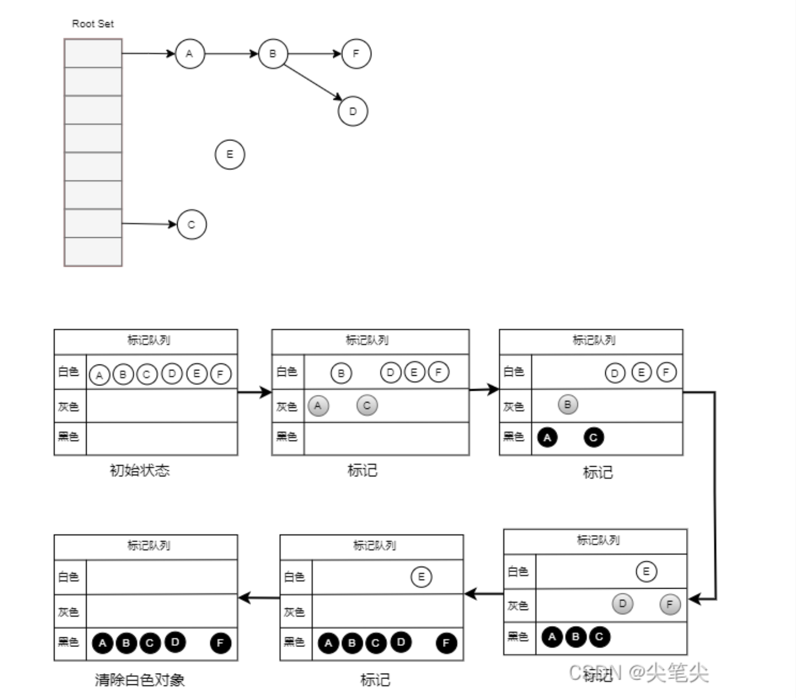

# 什么是GC

- GC，全称 Garbage Collection，即垃圾回收，是一种自动内存管理的机制；
- 当程序向操作系统申请的内存不再需要时，垃圾回收主动将其回收并供其他代码进行内存申请时候复用，或者将其归还给操作系统；
- 针对内存级别资源的自动回收过程

# 常见GC算法

引用计数

标记-清除

分代收集

# 三色标记法

## 三色抽象

定义了三种不同类型的对象，并用不同的颜色相称：

- 白色：未搜索的对象，在回收周期开始时所有对象都是白色，在回收周期时所有的白色都是垃圾对象
- 灰色：正在搜索的对象，该类对象可能还存在外部引用对象
- 黑色：已搜索完的对象，这类对象不再有外部引用对象

## 标记流程

- 初始状态下所有对象都是白色的；

- 从根节点对象开始遍历所有对象，把遍历到的对象变成灰色，放入待处理队列；

- 遍历所有灰色对象，将遍历到的灰色对象变成 黑色，同时将它引用的对象变成灰色并加入到待处理队列；
- 循环步骤3，直到待处理队列为空（所有灰色对象都变为黑色）；
- 剩下没有被标记的白色对象就认为是垃圾对象。

## 三色不等式

