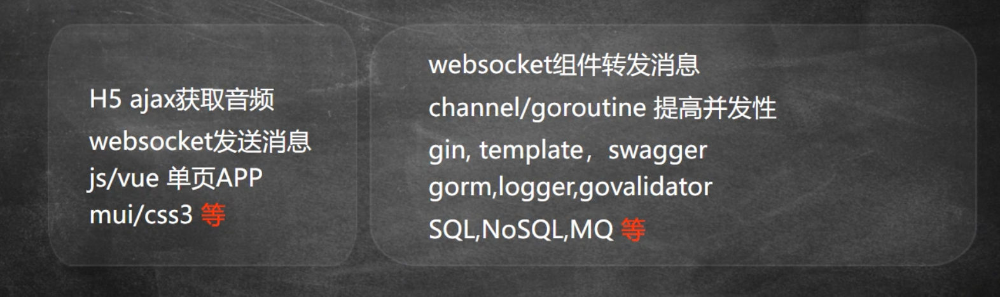
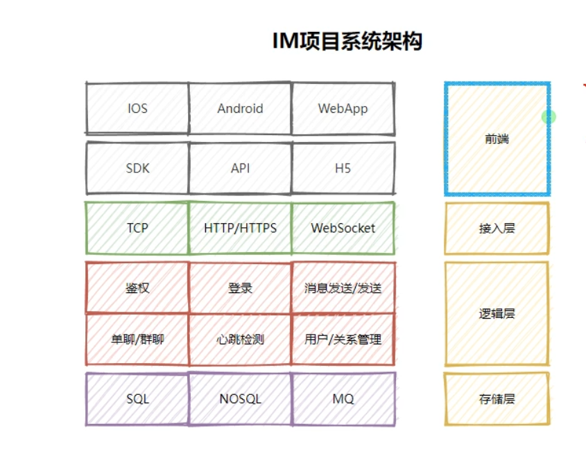
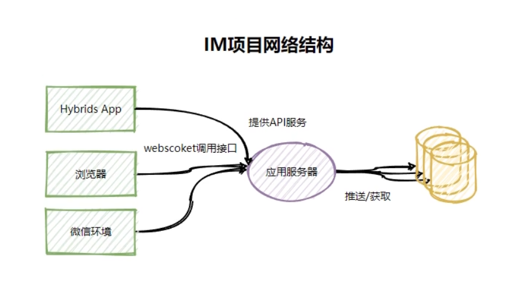
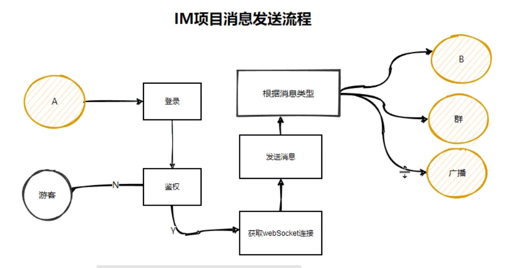

# 核心功能

# 技术栈

# 系统架构

# 网路结构

# 消息发送流程

# 代码目录树

- main.go：主函数，程序入口
- router：路由目录
  - app.go
- service：功能逻辑块
  - index.go
- utils
  - system_init.go：程序初始化
- test：测试案例
  - testdemo.go
- config：各种配置文件
  - app.yml：数据库配置信息
- models：各种模型设计
  - user_basic.go：用户基本信息数据表

