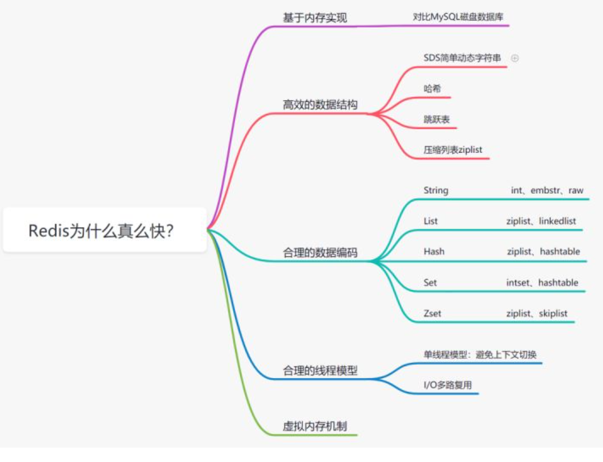

- 基于内存存储实现

- 高效的数据结构：
  - 获取字符串长度，时间复杂度是O(1)
  - SDS修改和空间扩充，会额外分配未使用的空间，减少性能损耗
  - SDS 缩短时，不是回收多余的内存空间，而是free记录下多余的空间，后续有变更，直接使用free中记录的空间，减少分配
  - 可以存储一些二进制数据， SDS中标志字符串结束的是len属性
  
- 合理的数据编码
  - String：
    - 存储数字用int；
    - 存储非数字：小于等于39字节用embstr；大于39个字节用raw。
  - List：如果列表的元素个数小于512个，列表每个元素的值都小于64字节（默认），使用ziplist编码，否则使用linkedlist编码
  - Hash：哈希类型元素个数小于512个，所有值小于64字节的话，使用ziplist编码,否则使用hashtable编码。
  - Set：如果集合中的元素都是整数且元素个数小于512个，使用intset编码，否则使用hashtable编码
  - Zset：当有序集合的元素个数小于128个，每个元素的值小于64字节时，使用ziplist编码，否则使用skiplist（跳跃表）编码
  
- 合理的线程模型

  - I/O多路复用：

    - I/O：网络I/O
    - 多路：多个网络链接
    - 复用：复用同一个线程

    ​        I/O多路复用是一种同步IO模型，它实现了一个线程可以监视多个文件句柄；一旦某个文件句柄就绪，就能够通知应用程序进行相应的读写操作；而没有文件句柄就绪时,就会阻塞应用程序，交出cpu

  - Redis是单线程模型的，避免了CPU不必要的上下文切换和竞争锁的消耗。

  - 正因为是单线程，如果某个命令执行过长（如hgetall命令），会造成阻塞，所以要慎用如smembers和lrange、hgetall等命令

  - Redis 6.0 引入了多线程提速，它的执行命令操作内存的仍然是个单线程

  

- 虚拟内存机制

