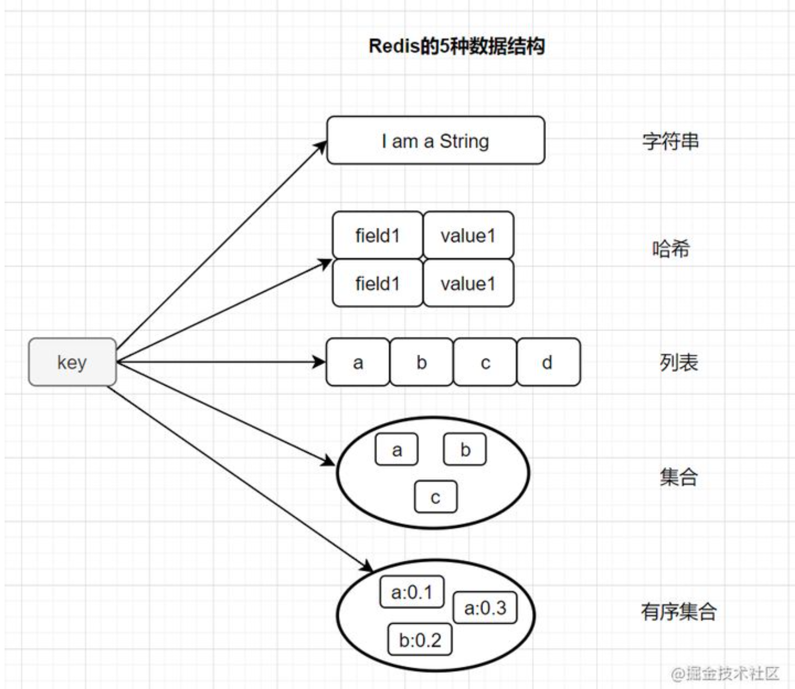
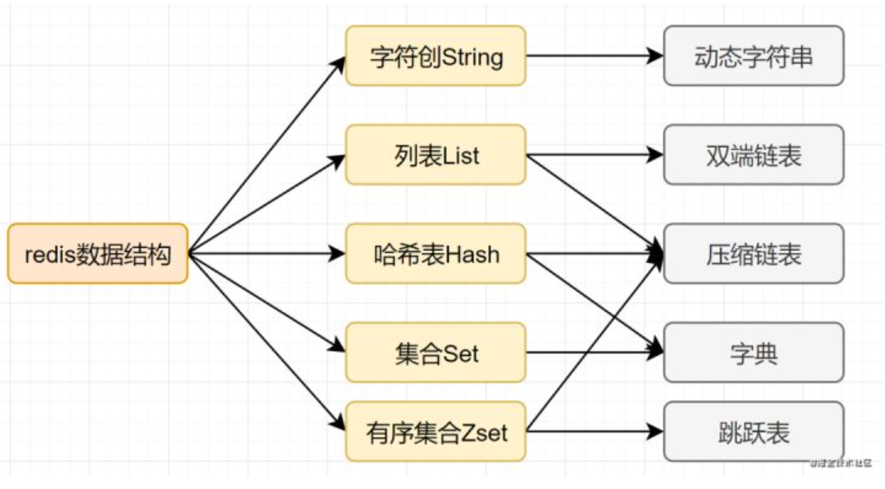
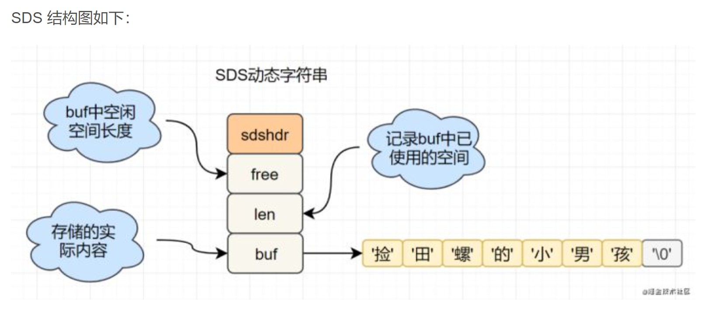

# 基础概念

# String

- 是二进制安全的

- 可以存储图片或序列化的对象

- 值最大存储为512M

- 内部编码有3种：

  - int（8字节长整型）
  - embstr（小于等于39字节字符串）
  - raw（大于39个字节字符串）

- 使用SDS封装：

  

- 

# Hash

- v本身又是一个k-v结构
- 内部编码：
  - ziplist（压缩列表）
  - hashtable（哈希表）

# List

- 存储多个有序的字符串
- 一个list最多可以存储2^32-1个元素
- 内部编码：
  - ziplist
  - linkedlist

# Set

- 存储多个字符串元素
- 不允许重复元素
- 内部编码：
  - intset（整数集合）
  - hashtable（哈希表）

# Zset

- 已排序的字符串集合
- 元素不能重复
- 内部编码：
  - ziplist（压缩列表）
  - skiplist（跳跃表）